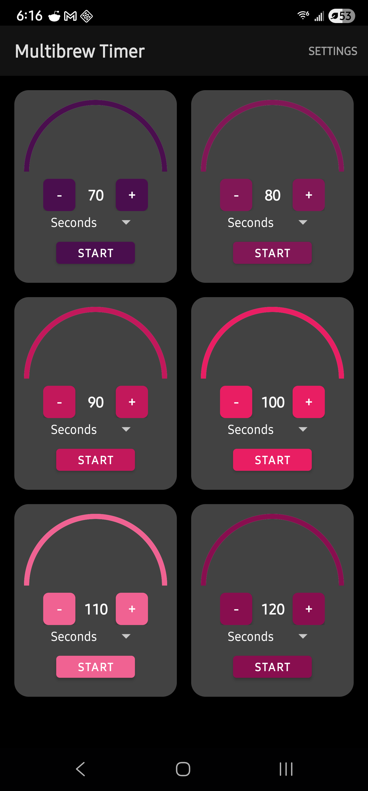
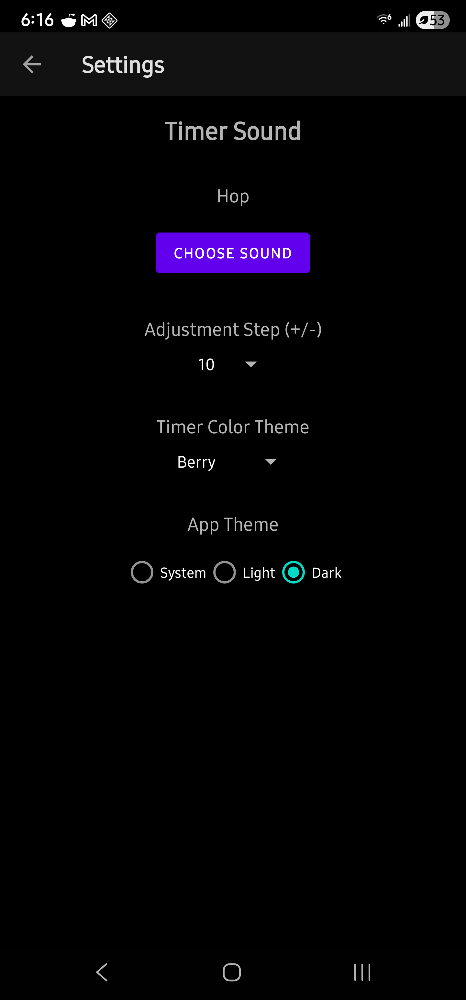

# Multibrew Timer

A timer that has precisely what I wanted out of a tea brewing timer app. I set it up to be super simple, and let me have timers ready to go for 70, 80, 90, 100, 110, 120 seconds. These times are customizable, and saved between app restarts. Set it up however you need!

## Features

- **Concurrent Timers**: Manage up to 6 timers at once in a compact 2x3 grid.
- **Customizable Themes**: Choose from 6 beautiful color palettes:
    - **Original**: Vibrant multi-color.
    - **Matcha**: Earthy greens and forest tones.
    - **Berry**: Rich purples and reds.
    - **Ocean**: Deep blues and teals.
    - **Sunset**: Warm oranges and yellows.
    - **Zen**: Minimalist monochromatic greys.
- **Background Reliability**: Built with `AlarmManager` to ensure timers finish accurately even if the app is closed or in the background.
- **Custom Notifications**: Support for custom ringtones and smart notification handling (manual playback in foreground, system notification in background).
- **Flexible Units**: Supports Seconds, Minutes, and Hours.
- **Pure Black Dark Mode**: Optimized for OLED screens.

## Technical Details

- **Language**: Java (Native Android)
- **Minimum SDK**: 24 (Android 7.0 Nougat)
- **Target SDK**: 34 (Android 14)
- **Architecture**: Lightweight Model-View-Adapter pattern with custom `CircleTimerView` for visualization.

## Getting Started

1. Clone this repository.
2. Open the project in **Android Studio**.
3. **Sync Project with Gradle Files**.
4. Run on a physical device or emulator.

## Preview

  
  &nbsp;&nbsp;&nbsp;&nbsp;
  

  <i>The main timer grid (Berry theme) and the settings page.</i>

